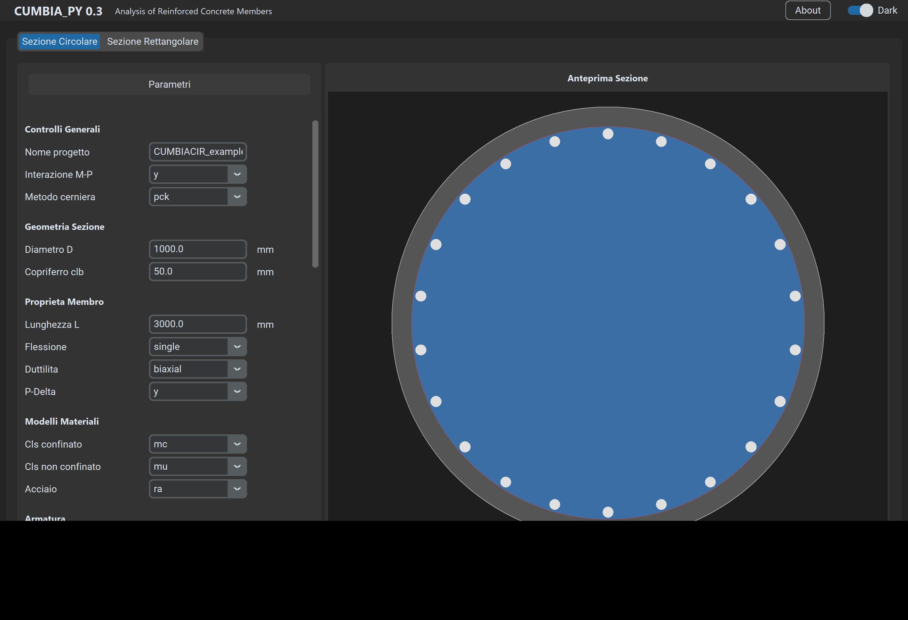
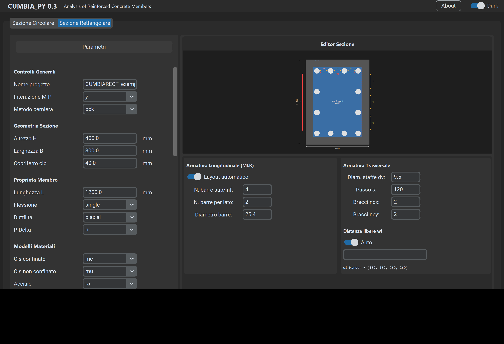

# CUMBIA_PY

Moment-Curvature, Force-Displacement and Interaction Analysis of Reinforced Concrete Members.

Based on [CUMBIA_PY by Luis Montejo](https://github.com/LuisMontejo/CUMBIA_PY) (MIT License).  
**Contact (original author):** luis.montejo@upr.edu

---

## Overview

CUMBIA is a comprehensive analytical tool for evaluating the monotonic behavior of reinforced concrete (RC) members with circular or rectangular cross-sections. The program performs rigorous moment-curvature analyses and computes the analytical force-displacement response, providing structural engineers and researchers with a clear evaluation of potential deformation limit states.

The original MATLAB algorithms (`CUMBIACIR.m` and `CUMBIARECT.m`) have been entirely refactored into Python (`CUMBIA_CIR.py` and `CUMBIA_RECT.py`), leveraging open-source libraries such as `numpy`, `pandas`, and `matplotlib`.

## Graphical User Interface

Version 0.3 introduces a complete GUI built with [CustomTkinter](https://github.com/TomSchimansky/CustomTkinter), launched via `main.py`.

<p align="center">
  
</p>

### Circular Section
<p align="center">
  
</p>

### Rectangular Section
<p align="center">
  
</p>

**Features:**
- Tabbed interface for circular and rectangular sections
- Interactive cross-section preview with live update
- MLR editor for rectangular sections (auto-generate or manual layer-by-layer input)
- Visual wi display showing both bar-to-bar gaps and Mander restrained-bar gaps
- Stirrup/crosstie editor with ncx, ncy controls
- Save/Load input parameters as JSON
- Automated output to user-chosen folder with PDF report auto-open
- Dark/Light theme toggle
- English/Italian language toggle (click **IT**/**EN** in the title bar; restart required)
- Tooltip help on every parameter

## Modifications from Original Code

This version includes bug fixes and enhancements documented in detail in [CHANGES.md](CHANGES.md). Summary:

### 1. Confinement Model Fix (CUMBIA_RECT.py)
The automatic `wi` calculation now correctly computes clear distances between **restrained bars only** (tied by stirrup corners or crossties), as required by the Mander confinement model. The original code computed distances between all peripheral bars regardless of restraint.

### 2. Buckling Models Fix (CUMBIA_RECT.py)
- **Goodnight et al. (2015):** strain-based and drift-based formulas now use the average transverse steel ratio across both directions instead of `rho_y` (Y-direction only).
- **Moyer & Kowalsky:** the critical strain formula now uses the extreme fiber bar diameter (`dbl_extreme`) instead of the maximum bar diameter in the section.

### 3. Theoretical Enhancements (from v0.2)
- **Modified Plastic-Hinge Method:** Goodnight et al. (2016) method with decoupled flexure and strain penetration components
- **Modern Bar Buckling Limits:** Goodnight et al. (2015) strain-based and drift-based models
- **Spiral Yielding Limit State:** automatic calculation for circular sections
- **P-Delta Effects:** dedicated toggle for approximate P-Delta correction
- **Scaled 2D Cross-Section Plotting**
- **Unified Multi-Page PDF Reports** with all figures and formatted summary
- **Native Excel Export** (`.xlsx`)

## Requirements

- Python 3.10+
- numpy
- pandas
- matplotlib
- openpyxl
- customtkinter

Install dependencies:

```bash
pip install -r requirements.txt
```

## Usage

### GUI Mode
```bash
python main.py
```

### Script Mode (no GUI)
Edit the input parameters directly in `CUMBIA_CIR.py` or `CUMBIA_RECT.py` and run:
```bash
python CUMBIA_CIR.py
python CUMBIA_RECT.py
```

## Output

Each analysis produces:
- **Excel workbook** (`_Results.xlsx`) with moment-curvature data, interaction diagram, and summary report
- **Multi-page PDF report** (`_Full_Report.pdf`) with all figures and formatted text
- **Individual PNG figures** (stress-strain, moment-curvature, force-displacement, buckling models, limit states, interaction diagram)

## License

MIT License — see [LICENSE](LICENSE) for details.

**Original analysis engine:** Luis Montejo  
**GUI, enhancements, and distribution:** Lorenzo Buratti
